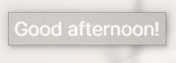

# `GoodWhatever`

A simple Rainmeter skin.

# Installation
Just go to [Releases](https://github.com/tilda/GoodWhatever/releases) and download the rmskin.

# Configuration
All configuration is in the .ini file. I'm not about to make a whole config GUI for something *this* simple :P

Every option is commented to make it easier for you, just in case.

# Thanks
Rasmus Andersson for creating the font used by default, [Inter](https://rsms.me/inter)

# License
MIT

*The Inter font included in GoodWhatever is licensed under the SIL Open Font License*